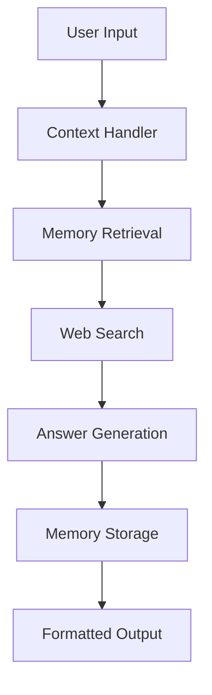

# Conversational Research Assistant

A stateful AI research assistant that combines conversation memory, web search, and generative AI to provide informed responses with source attribution.

## Features

- **Conversation Memory**: Maintains context across multiple interactions
- **Knowledge Retention**: Stores and recalls past Q&A pairs in a vector database
- **Web Research**: Integrates Tavily search for up-to-date information
- **Structured Responses**: Generates bullet-point answers with proper source attribution
- **Timeout Handling**: Automatically clears stale conversations

## Architecture

## Key Components
1. Chroma Vector Database
Stores conversation history as vector embeddings

Enables semantic search through past interactions

Persists between sessions (when not in development mode)

2. Google Generative AI
Embeddings: models/embedding-001 for vector representations

Chat Model: gemini-1.5-flash for response generation

3. Tavily Search
Real-time web search integration

Returns content with source attribution

Limited to top 3 results per query

4. LangGraph Workflow
Orchestrates the multi-step research process

Maintains conversation state

Handles error cases gracefully

Setup Instructions
Prerequisites
Python 3.9+

Google API key

Tavily API key

Installation
bash
git clone [your-repo-url]
cd [your-repo]
pip install -r requirements.txt
Configuration
Create .env file:

ini
GOOGLE_API_KEY=your_google_api_key
TAVILY_API_KEY=your_tavily_api_key
For development, the code automatically:

Clears existing Chroma DB

Creates fresh vectorstore

Initializes with placeholder document

Running the Assistant
python
python research_assistant.py
Usage Example
python
# First query
result1 = agent_executor.invoke({"user_input": "why is obesity increasing worldwide?"})

# Follow-up query 
result2 = agent_executor.invoke({"user_input": "what are the main contributing factors?"})

# Another follow-up
result3 = agent_executor.invoke({"user_input": "which countries are most affected?"})
Output Format
Responses include:

Bullet-point answers when appropriate

Source attribution for each major point

Complete reference list at the end

Example:

• According to Source 1, processed food consumption has increased by 40%...  
• Source 2 indicates sedentary lifestyles contribute to 30% of cases...

Sources:
Source 1: WHO Obesity Report - https://who.int/obesity
Source 2: Global Health Study - https://ghs.org/activity
Customization Options
Configuration Variables
CONVERSATION_TIMEOUT: Adjust conversation memory duration (default: 300s)

MAX_HISTORY: Change number of remembered messages (default: 10)

SEARCH_RESULTS: Modify number of web results (default: 3)

Vector Database
To persist memory between runs, remove the setup_chroma() call

Change embedding model in GoogleGenerativeAIEmbeddings initialization

Troubleshooting
Common Issues
API Errors: Verify keys in .env are correct

Chroma DB Lock: Manually delete chroma_db directory if crashes occur

Rate Limits: Add delay between queries if hitting API limits

Logging
Add this to debug:

python
import logging
logging.basicConfig(level=logging.DEBUG)
Future Enhancements
Add PDF/URL ingestion capability

Implement memory pruning/archiving

Add response validation step

Include image generation support
