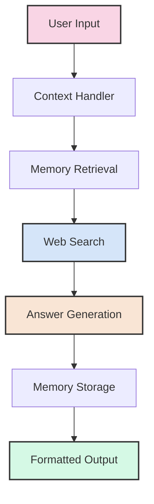

# 🔍 Conversational Research Assistant

A powerful, stateful AI assistant that combines conversation memory, web search, and generative AI to provide informed, source-attributed responses to complex research questions.


## ✨ Features

- **🧠 Conversation Memory** - Maintains natural context across multiple interactions
- **💾 Knowledge Retention** - Stores and recalls past Q&A pairs using vector embeddings
- **🌐 Web Research** - Integrates Tavily search API for real-time information retrieval  
- **📝 Structured Responses** - Generates clear, organized answers with proper source attribution
- **⏱️ Timeout Handling** - Automatically clears stale conversations for optimal performance
- **🔄 Follow-up Capability** - Understands context from previous questions

## 🏗️ Architecture



## 🧩 Key Components

### 1. Vector Database (Chroma)
- Stores conversation history as semantic vector embeddings
- Enables high-quality retrieval through past interactions
- Persists between sessions for continuous knowledge building
- Configurable for development or production environments

### 2. Google Generative AI
- **Embeddings**: `models/embedding-001` for high-quality vector representations
- **Chat Model**: `gemini-1.5-flash` for fast, coherent response generation
- Handles nuanced understanding and natural language generation

### 3. Tavily Search Integration
- Real-time web search capabilities with broad coverage
- Returns content with complete source attribution
- Configurable number of results per query (default: top 3)
- Provides up-to-date information beyond model training data

### 4. LangGraph Workflow Orchestration
- Coordinates the multi-step research process
- Maintains conversation state across interactions
- Handles error cases gracefully with fallback mechanisms
- Enables complex reasoning chains for better answers

## 🚀 Getting Started

### Prerequisites
- Python 3.9+
- Google API key
- Tavily API key

### Installation

```bash
# Clone the repository
git clone https://github.com/yourusername/conversational-research-assistant.git
cd conversational-research-assistant

# Create and activate virtual environment (optional but recommended)
python -m venv venv
source venv/bin/activate  # On Windows: venv\Scripts\activate

# Install dependencies
pip install -r requirements.txt
```

### Configuration

Create a `.env` file in the project root:

```ini
GOOGLE_API_KEY=your_google_api_key
TAVILY_API_KEY=your_tavily_api_key
DEVELOPMENT_MODE=True  # Set to False for production
```

### Running the Assistant

```python
from research_assistant import agent_executor

# First query
result1 = agent_executor.invoke({"user_input": "why is obesity increasing worldwide?"})
print(result1["output"])

# Follow-up query (maintains context)
result2 = agent_executor.invoke({"user_input": "what are the main contributing factors?"})
print(result2["output"])

# Another follow-up
result3 = agent_executor.invoke({"user_input": "which countries are most affected?"})
print(result3["output"])
```

## 📊 Example Output

```
QUERY: "Why is obesity increasing worldwide?"

RESPONSE:
• Global obesity rates have nearly tripled since 1975, with over 650 million adults classified as obese as of 2022 (Source 1)

• Key factors driving this increase include:
  - Increased consumption of energy-dense foods high in fat and sugars
  - Decreased physical activity due to sedentary work, changing transportation modes, and urbanization
  - Economic development and food system changes favoring processed foods (Source 2)

• Obesity is no longer just a high-income country problem, with rapid increases now occurring in low- and middle-income countries (Source 3)

Sources:
Source 1: World Health Organization - https://www.who.int/news-room/fact-sheets/detail/obesity-and-overweight
Source 2: The Lancet Global Health - https://www.thelancet.com/journals/langlo/article/PIIS2214-109X(19)30260-8/fulltext
Source 3: Global Nutrition Report - https://globalnutritionreport.org/reports/global-nutrition-report-2021/
```

## ⚙️ Customization Options

### Configuration Variables

Adjust these variables in `config.py` to customize behavior:

```python
# Conversation settings
CONVERSATION_TIMEOUT = 300  # Seconds until conversation is considered stale
MAX_HISTORY = 10            # Maximum number of previous exchanges to consider
SEARCH_RESULTS = 3          # Number of web search results to retrieve
DEVELOPMENT_MODE = True     # Clear DB on startup when True
```

### Vector Database Options

To persist memory between runs in production:

```python
# In main.py
if not DEVELOPMENT_MODE:
    # Use existing DB if available
    vectorstore = Chroma(
        collection_name="research_assistant",
        embedding_function=GoogleGenerativeAIEmbeddings(model="models/embedding-001")
    )
else:
    # Development mode - fresh DB each time
    setup_chroma()
```

### Search Configuration

Modify search behavior in `search_service.py`:

```python
def perform_search(query, max_results=SEARCH_RESULTS):
    """
    Customizable search function
    
    Args:
        query: The search query
        max_results: Number of results to return
        
    Returns:
        List of search results with source attribution
    """
    # Implementation details...
```

## 🔧 Troubleshooting

### Common Issues

| Issue | Solution |
|-------|----------|
| API Authentication Errors | Verify API keys in `.env` file are correct and have necessary permissions |
| Chroma DB Locking | Delete the `chroma_db` directory manually if application crashes unexpectedly |
| Rate Limit Errors | Add delay between queries or upgrade API tier if hitting service limits |
| Memory Consumption | Reduce `MAX_HISTORY` if application uses too much RAM |

### Enabling Debug Logging

```python
import logging
logging.basicConfig(level=logging.DEBUG)
```

## 🛣️ Roadmap

- [ ] PDF and URL document ingestion capabilities
- [ ] Memory pruning and archiving for long-term usage
- [ ] Response validation and fact-checking steps
- [ ] Image generation support for visual content
- [ ] Multi-user support with isolated conversation threads
- [ ] API endpoint for web/mobile integration

## 📄 License

This project is licensed under the MIT License - see the [LICENSE](LICENSE) file for details.

## 🙏 Acknowledgements

- Powered by Google Generative AI (Gemini)
- Search capabilities provided by Tavily
- Vector storage powered by Chroma
- Workflow orchestration via LangGraph

---

**Made with ❤️ by [Your Name/Organization]**
